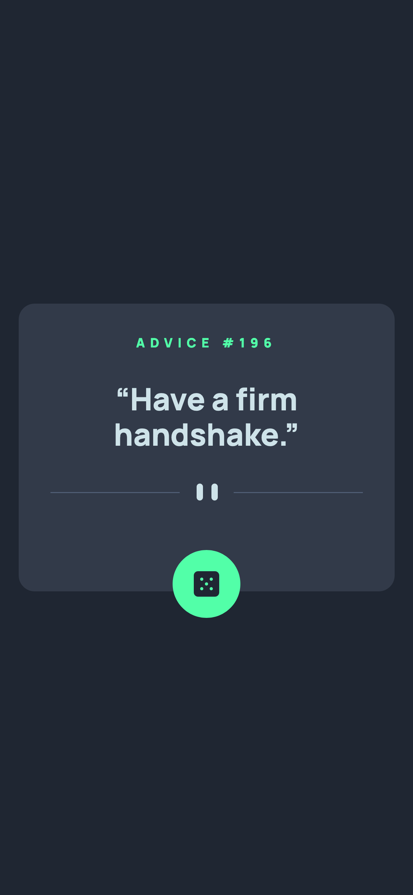

# Frontend Mentor - Advice generator app solution

This is a solution to the [Advice generator app challenge on Frontend Mentor](https://www.frontendmentor.io/challenges/advice-generator-app-QdUG-13db). Frontend Mentor challenges help you improve your coding skills by building realistic projects.

## Table of contents

- [Overview](#overview)
  - [Screenshot](#screenshot)
  - [Links](#links)
- [My process](#my-process)
  - [Built with](#built-with)
  - [What I learned](#what-i-learned)
  - [Continued development](#continued-development)
  - [Useful resources](#useful-resources)
- [Author](#author)

## Overview

### Screenshot

### Screenshot - mobile

### Links

- Solution URL: [Add solution URL here](https://your-solution-url.com)
- Live Site URL: [Add live site URL here](https://your-live-site-url.com)

## My process

### Built with

- CSS custom properties
- Flexbox
- Mobile-first workflow
- [Normaliz](https://necolas.github.io/normalize.css//) - modern, HTML5-ready alternative to CSS resets

### What I learned

I was really tempted to over-engineer this and try using a NodeJS package to grab the Advice Slip API - but keeping it simple seemed to be the most effectice method, and it was nice to just utilise some basic JavaScript.

### Continued development

I'll attempt another JS challenge to keep my skills fresh. On the front-end side, I don't think index.html would be considered as semantic so I would like to focus on making sure I'm using semantic markup when using HTML.

### Useful resources

- [MDN web docs - JSON.parse()](https://developer.mozilla.org/en-US/docs/Web/JavaScript/Reference/Global_Objects/JSON/parse) - This helps
- [MDN web docs - Working with JSON](https://developer.mozilla.org/en-US/docs/Learn/JavaScript/Objects/JSON) - This is an amazing article which helped me finally understand XYZ. I'd recommend it to anyone still learning this concept.

## Author

- Github - [@valleyman89](https://github.com/valleyman89)
- Frontend Mentor - [@valleyman89](https://www.frontendmentor.io/profile/valleyman89)
- Twitter - [@steven_rolph](https://www.twitter.com/yourusername)
